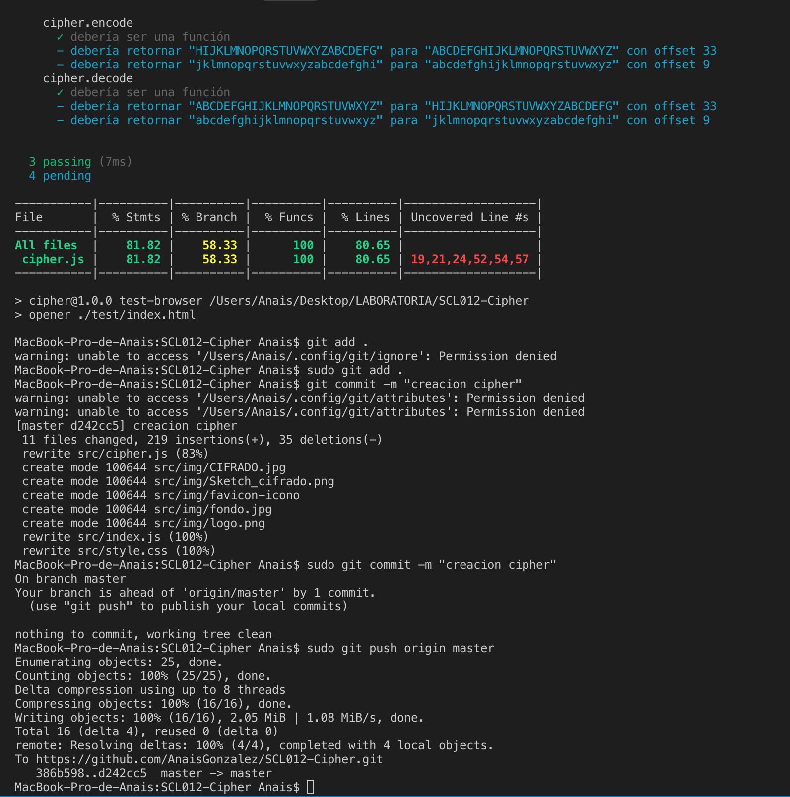

# Cifrado César

Solicitud de creación de proyecto, donde se pueda cifrar y descifrar mensajes a través del Cifrado César, utilizando codigo Ascii.

Cada persona que quiera comunicarse escribe o pega su texto, se ponde de acuerdo en el número a utilizar en cifrado, para que así coincida con el recetor, presiona el botón con la opción correspondiente y listo "Texto Cifrado 😀"

## Resumen del proyecto

Esta aplicación es una mensajeria secreta para personas que quieran eviarse mensajes de manera segura, para no ser descubiertos por un tercero.

- Target: Esta pensado para cualquier persona u organización que quiera comunicarse con otra y no quiere que su mensaje sea descubierto facilmente, para hacer algo ilegal u oculto o simplemente no comunicarse de manera simple.

- Idea y Objetivo: Debido a la contingencia social del momento y la cantidad de personas que se han descubierto organizandose mediantes chat como WhatsApp, para algún tipo de manifestación, es que decido crear esta aplicación donde puedes cifrar y descifrar tus mensajes y pegarlos y enviarlos por cualquier tipo de chat u correo (WhatsApp, Telegram, Signal u Gmail), y así no ser descubierto por 3ros u organizaciones del estado.

## UX
- Ideación: Creado de manera simple, solo con una pantalla para que se pueda utilizar de manera rapida.

- Prototipado (sketching): En base a la idea de un diseño simple de una página se crea en sketch para ver la funcionalidad, creado en Balsamiq

![[Sketch]](imgR/Sketch_cifrado.png)

Luego cree el prototipo de alta fidelidad en Figma, con un diseño que represente tecnologia y seguridad.

![[Prototipo]](imgR/CIFRADO.jpg)

Aqui esta el prototipo interactivo, modo explicativo del funcionamiento.[![Prototipo interactivo de Figma]](https://www.figma.com/proto/i410BH7ZFIJCeYczCF9Lsl/Cifrado?node-id=1%3A2&scaling=min-zoom)

- Iteración: Se muestra la aplicación a distintos tipos de personas, como diseño y simplicidad esta funcionando correcto. Pero en cuanto a funcionalidad hay cosas que no se entienden, como el offset, saber que número seleccionar y por qué. En base a esto se crea la frase "¡Ingrese el número que decidan con tu cómplice para comunicarse!"  y un texto explicactivo pequeño antes del offset y se deja con parametros de 1 a 10 para simplificar al usuario.

## Testing
- Se genero testeos para comprobación de funciones, despues de resolver errores pasa correcto.

## Objetivos

Los objetivos de aprendizaje y del proyecto fueron cubiertos, aprendí a cifrar, ocupar funcionalidades, testear, prototipar y la página quedo como lo tenia pensado.👌

